# 认证中心

1. [keycloak](https://www.keycloak.org/)

2. [justauth](https://www.justauth.cn/)

## 构建

```
make image
make push
```

## 启动

```
docker-compose up -d
```

访问地址 `localhost:8080`， 默认账号是 `admin/admin`

由于真实环境中会有第三方登录，比如 `钉钉登录，企业微信登录`，会涉及到回调域名，所以一般会使用 `nginx` 做反向代理，通过一个二级域名进行访问应用，比如 `http://account.example.org`，这样会比较方便。

## 钉钉登录

### 创建钉钉企业内部应用

1. 登录 [钉钉开放平台](https://open-dev.dingtalk.com/)

2. 创建钉钉企业内部应用

    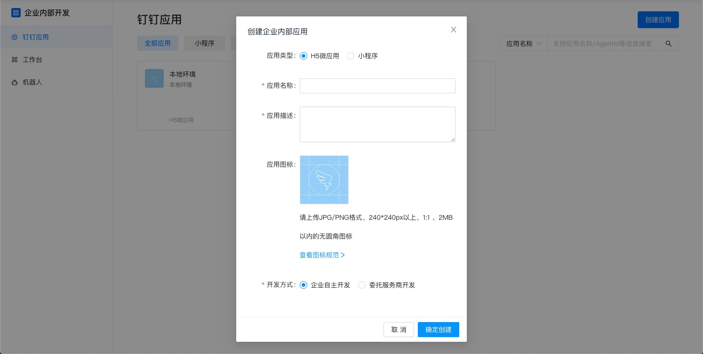

3. 查看基础信息

    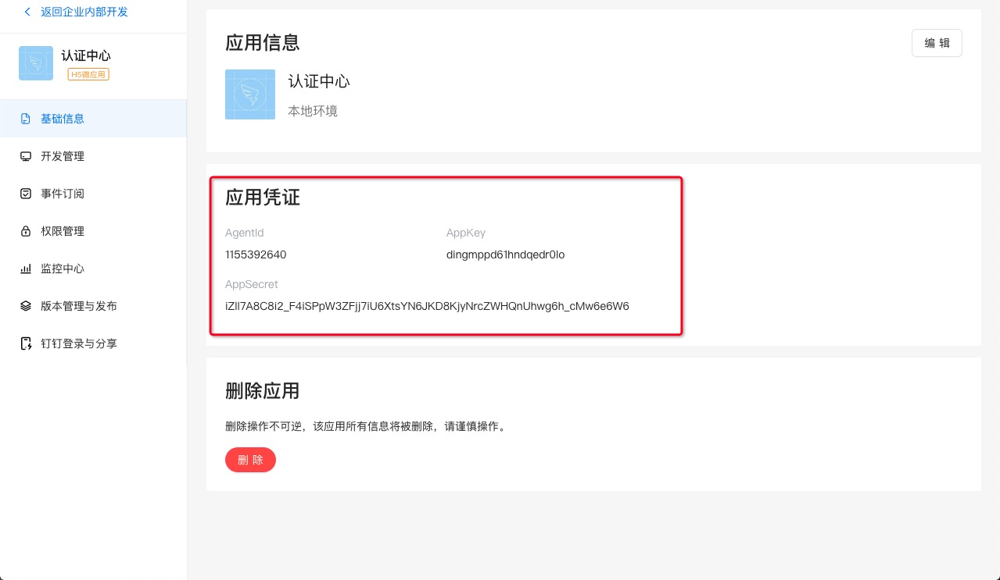

4. 修改开发管理，填写服务器出口IP和首页地址 `http://account.example.org/auth/realms/palan/account`

    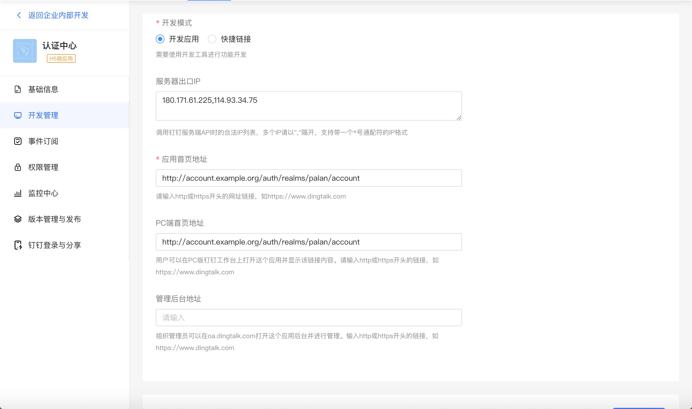

5. 填写接入登录回调域名 `http://account.example.org/auth/realms/palan/broker/ding_talk/endpoint`

    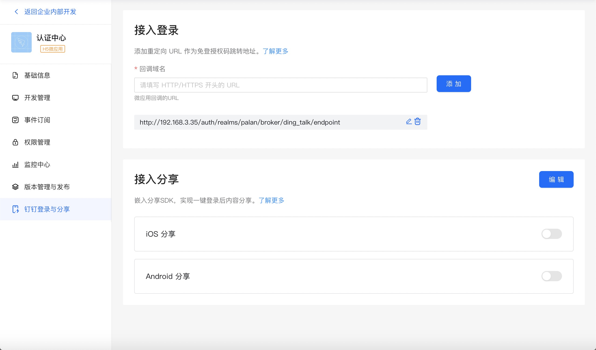

### 创建钉钉身份提供者

1. 登录 [认证中心管理页面](http://account.example.org/auth/admin)

2. 进入身份提供者列表页面，添加钉钉

    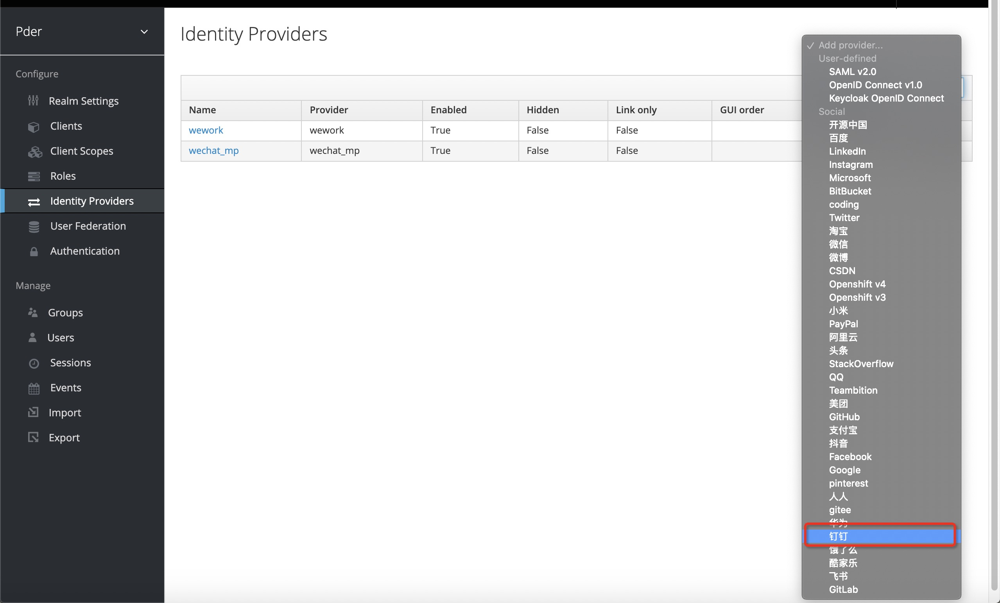

3. 填写相应配置，`Client ID=AppKey, Client Secret=AppSecret`

    

4. `autoLoginDingTalkEnabled ` 属性是控制是否在钉钉应用中访问自动免密登录，不开启的话就都是扫码登录或者用户名密码登录

5. 如果需要提取用户属性可以通过 `DingTalk Enterprise User Mapper` 起来实现，比如我们可以根据钉钉通讯录中自定义用户名来作为统一的账户名，头像信息等等

    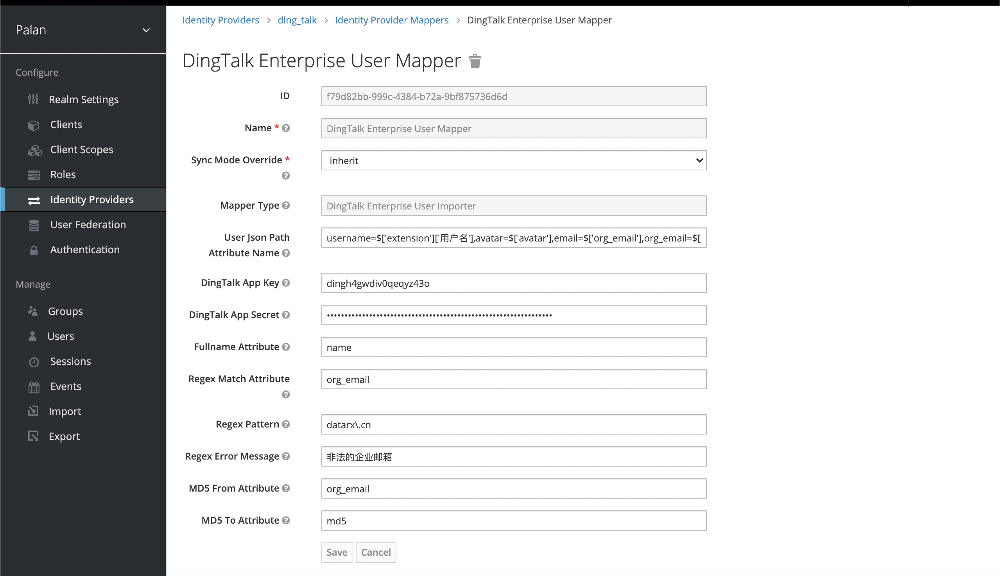

    这里特别要注意的点是 `User Json Path Attribute Name` 这里的配置内容 `username=$['extension']['用户名'],avatar=$['avatar'],email=$['org_email'],org_email=$['org_email'],name=$['name'],mobile=$['mobile']`

    其实就是根据 `,` 做分割，然后再根据 `=` 做分割等到的第一个的值作为用户属性的 `key`, 第二个值为 `Json Path` 表达式，然后再根据钉钉企业成员信息解析后提取用户属性

    假设请求钉钉企业成员详细接口后返回的内容如果是以下的内容的话

    ```json
    {
      "errcode": 0,
      "errmsg": "ok",
      "result": {
        "active": true,
        "admin": true,
        "avatar": "https:\/\/static-legacy.dingtalk.com\/media\/lADOCnFNdM0Cns0C7g_750_670.jpg",
        "boss": false,
        "dept_id_list": [
          1
        ],
        "dept_order_list": [
          {
            "dept_id": 1,
            "order": 176322897889314512
          }
        ],
        "email": "515265763@qq.com",
        "exclusive_account": false,
        "extension": "{\"用户名\":\"yuanzhencai\"}",
        "hide_mobile": false,
        "job_number": "",
        "leader_in_dept": [
          {
            "dept_id": 1,
            "leader": false
          }
        ],
        "mobile": "18321718279",
        "name": "袁振才",
        "org_email": "zhencai.yuan@datarx.cn",
        "real_authed": true,
        "remark": "",
        "role_list": [
          {
            "group_name": "默认",
            "id": 1507668010,
            "name": "主管理员"
          }
        ],
        "senior": false,
        "state_code": "86",
        "telephone": "",
        "title": "",
        "union_emp_ext": {},
        "unionid": "4L5xxXJOwj3iSGJpwa50qYgiEiE",
        "userid": "033156401534394431",
        "work_place": ""
      },
      "request_id": "71shv9eao41d"
    }
    ```

    最终这个用户创建的属性为以下内容

    ```text
    username=yuanzhencai
    avatar=https:\/\/static-legacy.dingtalk.com\/media\/lADOCnFNdM0Cns0C7g_750_670.jpg
    email=515265763@qq.com
    org_email=zhencai.yuan@datarx.cn
    name=袁振才
    mobile=18321718279
    ```

    `extension` 里的值是钉钉企业通讯录里通过 [创建自定义字段](https://oa.dingtalk.com/index_new.htm#/setting/contactInfo)，然后为每个 [成员信息](https://oa.dingtalk.com/hrmregister/web/index#/empManage/onJob) 中设置这个字段的内容后得到的，比如现在创建的这个 `用户名` 字段，就是代表钉钉用户的扫码登录认证中心后的统一用户名

    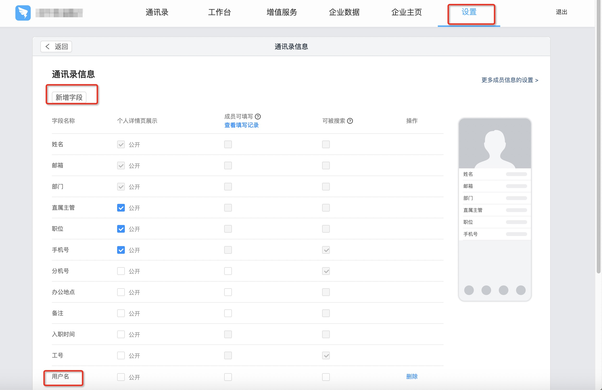

    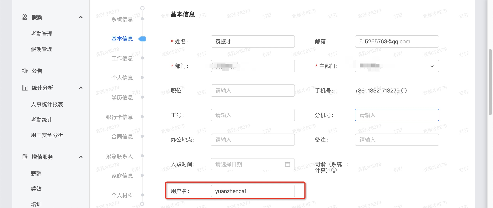

## 企业微信登录

### 创建企业微信应用

1. 登录 [企业微信管理页面](https://work.weixin.qq.com/wework_admin/frame)

2. 创建企业微信应用

    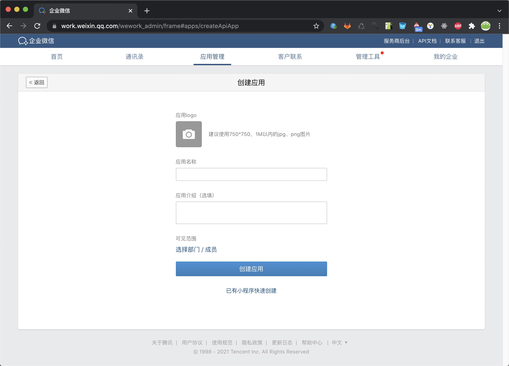

3. 设置应用首页地址，查看开发信息, `AgentId, Secret, 企业ID`

    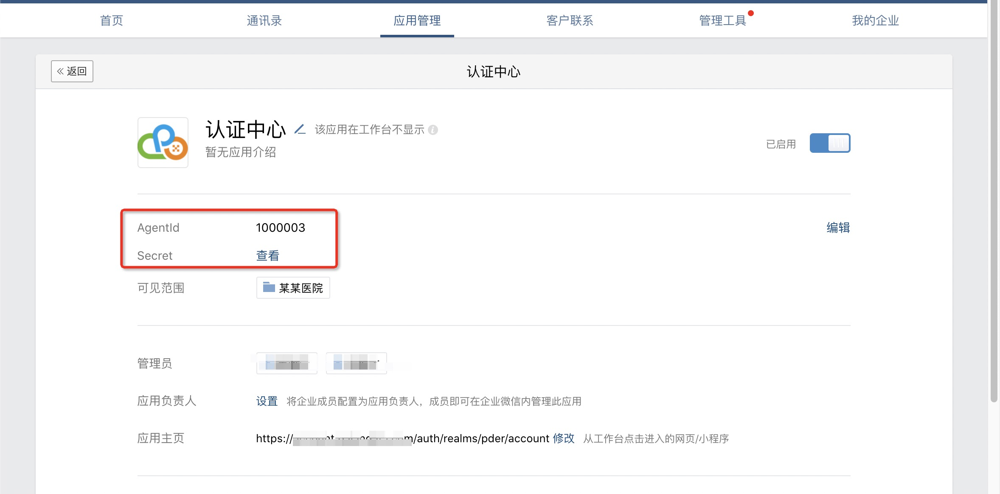
    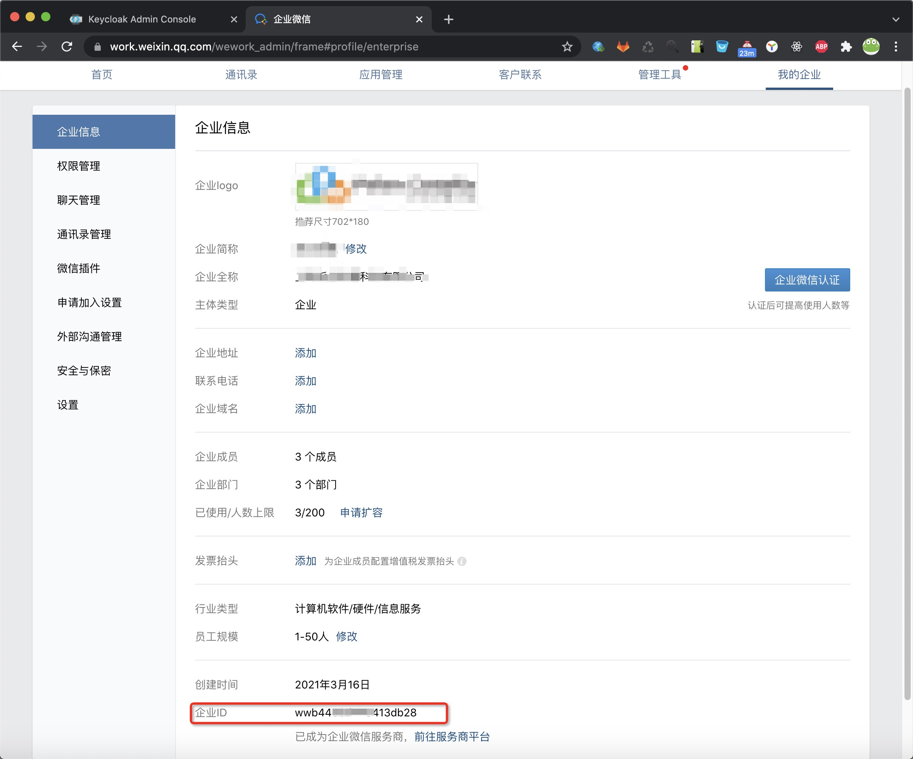
    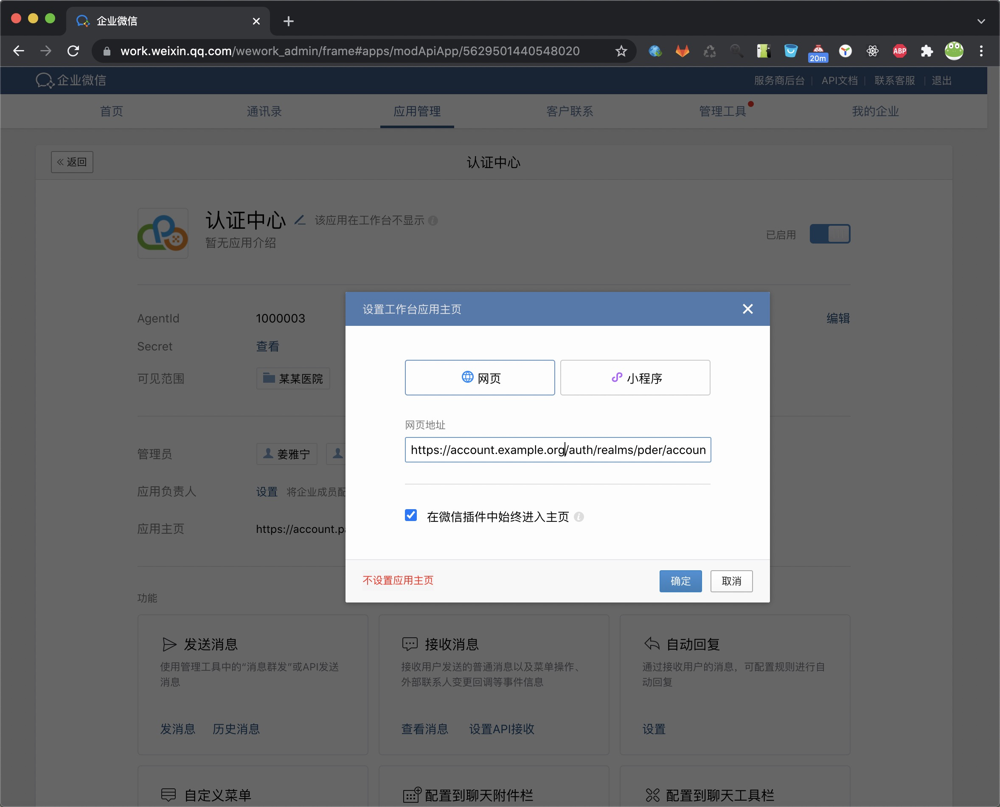

4. 在开发者接口中设置可信域名 `http://account.example.org`

    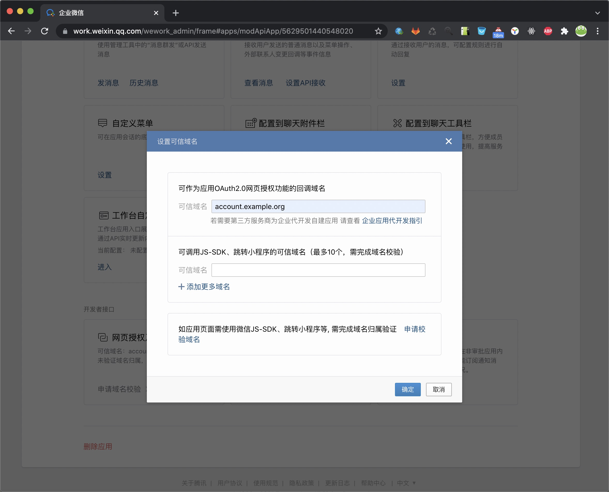

### 创建企业微信身份提供者

1. 登录 [认证中心管理页面](http://account.example.org/auth/admin)

2. 进入身份提供者列表页面，添加企业微信

    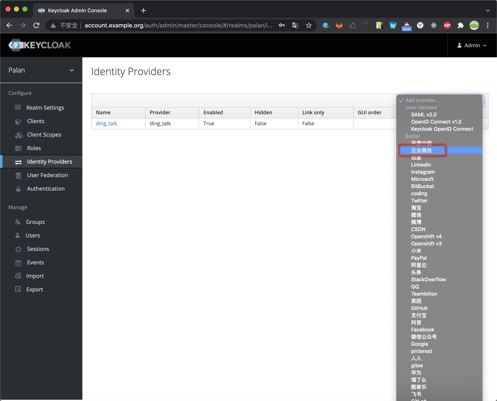

3. 填写相应配置，`Client ID=企业ID, Client Secret=Secret, agentId=AgentId`

    

4. `autoLoginWeworkEnabled` 属性是控制是否在企业微信应用中访问自动免密登录，不开启的话就都是扫码登录

5. 如果需要提取用户属性可以通过 `Json Expression Attribute Importer` 起来实现，比如我们可以根据企业微信通讯录中的 `userid` 来作为统一的账户名，头像信息等等

    

    这里要特别注意的是 `User Json Expression Attribute Name` 里的内容 `username=userid,email=email,firstName=firstName(name),lastName=lastName(name),name=name,avatar=avatar,mobile=mobile`

    这里个钉钉登录里的不一样的地方就是这里有个特殊的需求，需要拆分用户属性变成两个用户属性，所以原来的 `Json Path` 就实现不了了，所以使用了 [aviator](http://fnil.net/aviator/) 表达式来实现表达式中支持自定义方法，比如 `firstName(name), lastName(name)`

    假设请求企业微信成员详细接口后返回的内容如果是以下的内容的话

    ```json
    {
        "errcode": 0,
        "errmsg": "ok",
        "userid": "yuanzhencai",
        "name": "袁振才",
        "department": [1, 2],
        "order": [1, 2],
        "mobile": "18321718279",
        "gender": "1",
        "email": "zhencai.yuan@datarx.cn",
        "is_leader_in_dept": [1, 0],
        "avatar": "http://wework.qpic.cn/bizmail/9rX6FVuxcn8KERqOFss12SvcYtroRUTU6QQVgibUQxs8RjLS6EUwvTg/0"
    }
    ```

    最终这个用户创建的属性为以下内容

    ```text
    username=yuanzhencai
    avatar=http://wework.qpic.cn/bizmail/9rX6FVuxcn8KERqOFss12SvcYtroRUTU6QQVgibUQxs8RjLS6EUwvTg/0
    email=zhencai.yuan@datarx.cn
    name=袁振才
    mobile=18321718279
    ```


## 公众号登录

### 开通网页授权权限

[参考文档](https://developers.weixin.qq.com/doc/offiaccount/OA_Web_Apps/Wechat_webpage_authorization.html)

需要开通 `网页授权获取用户基本信息` 权限，要注意的是 `订阅号无法开通此接口，服务号必须通过微信认证` 或者 `申请开发者资质认证`

开通后就可以得到 `appID` 和 `appsecret`

设置 `授权回调页面域名` 为 `account.example.org`

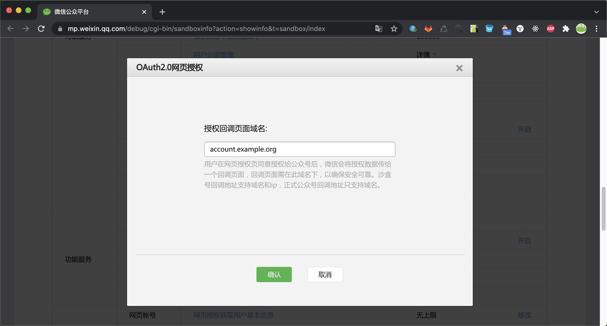

### 创建微信公众号身份提供者

1. 登录 [认证中心管理页面](http://account.example.org/auth/admin)

2. 进入身份提供者列表页面，添加微信公众号

    

3. 填写相应配置，`Client ID=appID, Client Secret=appsecret`

    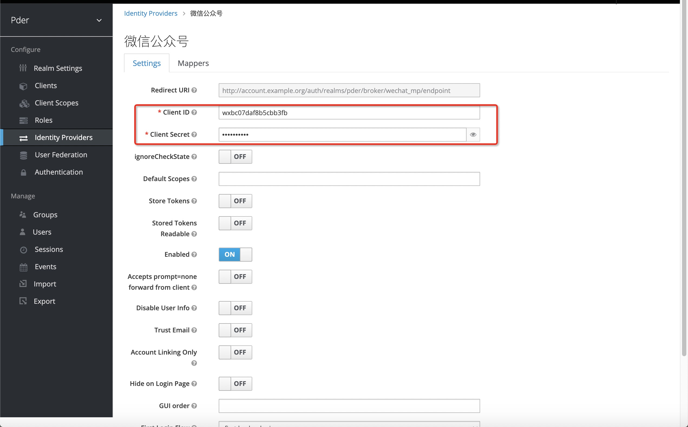
